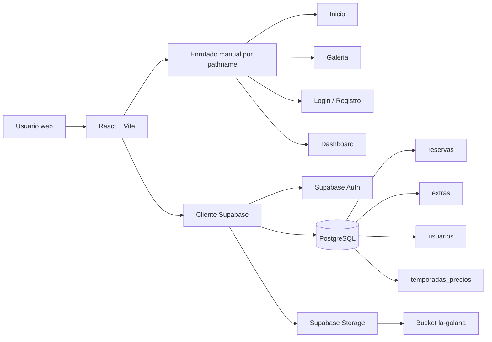
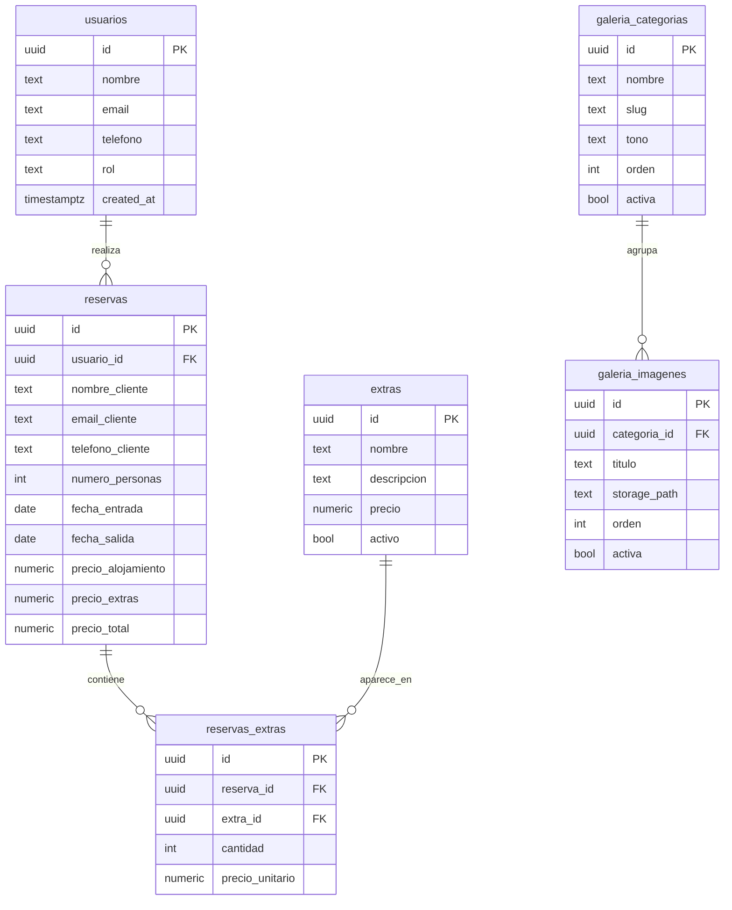
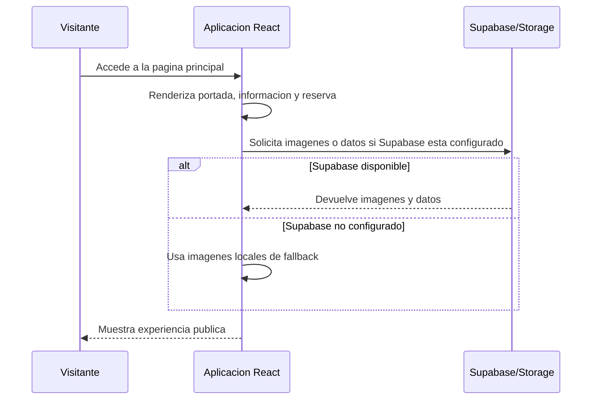
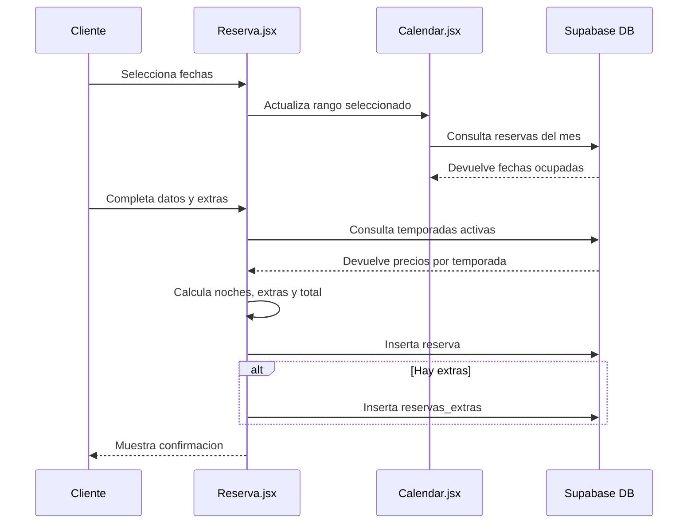
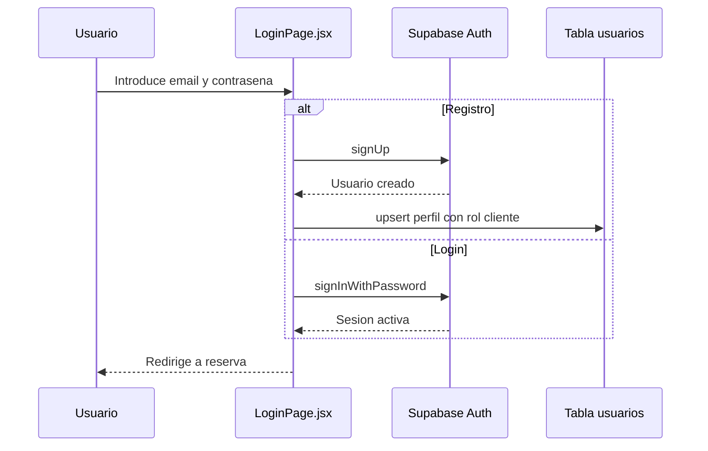
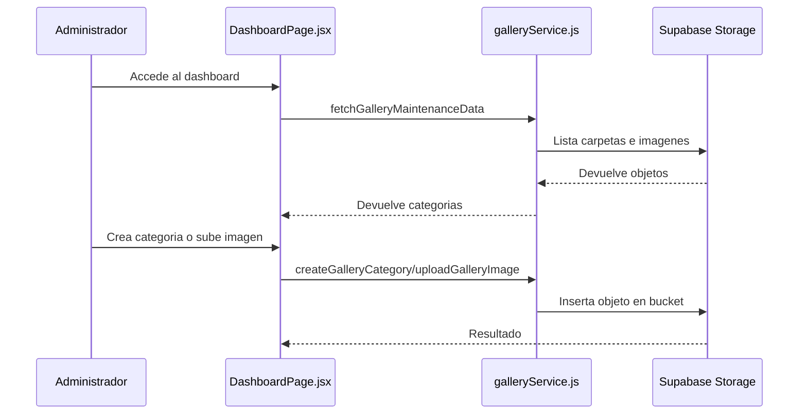

# Documento de diseno tecnico y funcional

## Proyecto: Casa Rural La Galana

**Version:** 1.0  
**Fecha:** 02/05/2026  
**Tipo de proyecto:** Aplicacion web para presentacion, reservas y gestion de galeria de una casa rural  
**Repositorio:** ProyectoIntermodular

---

## 1. Resumen ejecutivo

Casa Rural La Galana es una aplicacion web desarrollada con React, Vite, Tailwind CSS y Supabase. Su objetivo principal es ofrecer una experiencia publica cuidada para visitantes interesados en conocer la casa rural, consultar fotografias, revisar disponibilidad y solicitar una reserva.

El sistema tambien incorpora funcionalidades privadas asociadas a la autenticacion de usuarios y a un panel de mantenimiento para la gestion de la galeria fotografica. La aplicacion esta planteada como una solucion ligera, moderna y facil de desplegar, apoyandose en Supabase para autenticacion, base de datos PostgreSQL, politicas de seguridad y almacenamiento de imagenes.

El diseno del proyecto prioriza:

- Una experiencia visual atractiva y coherente con una casa rural.
- Un flujo de reserva claro, rapido y orientado a conversion.
- Una arquitectura frontend sencilla, mantenible y escalable.
- Integracion progresiva con Supabase sin bloquear la interfaz si la configuracion no esta disponible.
- Gestion dinamica de imagenes mediante Storage, con fallback local para mantener la aplicacion operativa.

---

## 2. Objetivos del sistema

### 2.1 Objetivos principales

- Presentar Casa Rural La Galana mediante una pagina publica visual, responsive y orientada al usuario final.
- Permitir al visitante consultar imagenes de exterior e interior de la casa.
- Facilitar la seleccion de fechas de entrada y salida mediante calendario interactivo.
- Registrar solicitudes de reserva con datos de cliente, numero de personas, fechas y extras.
- Calcular importes de alojamiento segun temporadas configuradas.
- Permitir registro e inicio de sesion de usuarios mediante Supabase Auth.
- Proporcionar un panel de mantenimiento para gestionar categorias e imagenes de la galeria.

### 2.2 Objetivos secundarios

- Mantener la aplicacion disponible aunque Supabase no este configurado, mostrando contenido local de respaldo.
- Reducir dependencias de backend propio delegando autenticacion, base de datos y almacenamiento en Supabase.
- Favorecer una estructura modular que permita evolucionar el proyecto sin reescrituras importantes.
- Ofrecer una base documentada para futuras entregas, defensa tecnica o mantenimiento.

---

## 3. Alcance funcional

### 3.1 Incluido

- Pagina de inicio con navegacion, portada, informacion, galeria destacada, formulario de reserva y pie de pagina.
- Pagina de galeria completa con secciones, grid responsive y visor modal.
- Pagina de login y registro.
- Gestion de sesion activa y cierre de sesion.
- Consulta de rol de usuario desde la tabla `usuarios`.
- Panel de dashboard para mantenimiento de galeria.
- Creacion y borrado de carpetas/categorias de galeria en Supabase Storage.
- Subida y eliminacion de imagenes desde el dashboard.
- Calendario de disponibilidad basado en reservas existentes.
- Seleccion de extras activos desde base de datos.
- Insercion de reservas y relacion con extras seleccionados.
- Calculo de precio total a partir de noches, temporadas y extras.

### 3.2 Fuera de alcance actual

- Pasarela de pago online.
- Confirmacion automatica de reservas por email.
- Backoffice completo para editar reservas, extras o temporadas.
- Sistema avanzado de permisos en interfaz para ocultar por completo el dashboard a usuarios no administradores.
- Internacionalizacion multiidioma.
- API backend propia.

---

## 4. Usuarios y roles

### 4.1 Visitante

Usuario anonimo que accede a la web para conocer la casa rural.

Puede:

- Ver la pagina principal.
- Navegar por la galeria.
- Consultar disponibilidad.
- Solicitar una reserva sin estar autenticado.
- Abrir contacto por telefono, WhatsApp o Google Maps.

### 4.2 Cliente

Usuario registrado mediante Supabase Auth.

Puede:

- Iniciar sesion.
- Cerrar sesion.
- Crear reservas asociadas a su cuenta.
- Mantener sus datos de perfil basicos en la tabla `usuarios`.

### 4.3 Administrador

Usuario con rol `admin` o `administrador` en la tabla `usuarios`.

Puede:

- Acceder al dashboard de mantenimiento.
- Crear carpetas/categorias de galeria.
- Subir imagenes al bucket publico `la-galana`.
- Eliminar imagenes.
- Eliminar categorias completas junto con sus imagenes.

---

## 5. Stack tecnologico

### 5.1 Frontend

- **React 19:** construccion de componentes, estado local y renderizado de vistas.
- **Vite 7:** servidor de desarrollo, empaquetado y optimizacion de build.
- **Tailwind CSS 4:** sistema de estilos utility-first y definicion de tokens visuales.
- **React Calendar:** calendario interactivo con seleccion de rango.
- **Framer Motion / Motion:** animaciones y revelados visuales.
- **GSAP:** disponible para animaciones avanzadas.

### 5.2 Backend como servicio

- **Supabase Auth:** registro, login, cierre de sesion y obtencion de usuario actual.
- **Supabase Database:** base de datos PostgreSQL para usuarios, reservas, extras, temporadas y metadatos de galeria.
- **Supabase Storage:** almacenamiento publico de imagenes de la galeria.
- **Row Level Security:** control de acceso a tablas y objetos de Storage.

### 5.3 Herramientas de calidad

- **ESLint:** analisis estatico.
- **npm scripts:** ejecucion de desarrollo, build, lint y preview.

---

## 6. Arquitectura general

La aplicacion sigue una arquitectura frontend modular. React gestiona las vistas y componentes, mientras que Supabase actua como proveedor externo de datos, autenticacion y almacenamiento.



### 6.1 Principios de diseno

- **Cliente ligero:** el frontend contiene la logica de interaccion y consume Supabase directamente.
- **Configuracion tolerante a fallos:** si faltan `VITE_SUPABASE_URL` o `VITE_SUPABASE_ANON_KEY`, la app evita romperse y utiliza imagenes locales cuando es posible.
- **Componentizacion por responsabilidad:** cada parte visual importante vive en un componente o pagina dedicada.
- **Datos dinamicos con fallback:** la galeria puede cargarse desde Supabase Storage o desde arrays locales.
- **Rutas simples:** el enrutado se resuelve desde `window.location.pathname`, sin dependencia de React Router.

---

## 7. Estructura del proyecto

```text
ProyectoIntermodular/
├── public/
│   └── images/la-galana/        # Imagenes locales de respaldo
├── src/
│   ├── components/              # Componentes reutilizables de UI
│   ├── components/PillNav/      # Navegacion principal tipo pildora
│   ├── data/                    # Datos estaticos y fallback de imagenes
│   ├── layouts/                 # Layouts compartidos
│   ├── pages/                   # Paginas principales
│   ├── services/                # Servicios de integracion
│   ├── styles/                  # Estilos globales y Tailwind
│   ├── supabase/                # Cliente Supabase
│   └── utils/                   # Utilidades compartidas
├── bbdd.md                      # Documentacion del modelo de base de datos
├── supabase-galeria.sql         # Script SQL para galeria y politicas
├── package.json                 # Dependencias y scripts
└── vite.config.js               # Configuracion Vite
```

---

## 8. Rutas y navegacion

La aplicacion no usa un router externo. El componente `App.jsx` evalua `window.location.pathname` y decide que pagina renderizar.

| Ruta | Pagina | Descripcion |
|------|--------|-------------|
| `/` | `Home.jsx` | Pagina principal |
| `/galeria` | `GalleryPage.jsx` | Galeria completa |
| `/login` | `LoginPage.jsx` | Login, registro y cierre de sesion |
| `/dashboard` | `DashboardPage.jsx` | Mantenimiento de galeria |

La navegacion interna tambien usa hashes como `/#hero`, `/#info` y `/#reserva`. Para sincronizar cambios de ruta sin router, se dispara el evento personalizado `app:navigate`.

---

## 9. Componentes principales

### 9.1 `Home.jsx`

Pagina principal de la web. Ensambla:

- `NavBar`
- `Hero`
- `Info`
- `Gallery`
- `Reserva`
- `Footer`
- `ScrollReveal`

Su responsabilidad es componer la experiencia publica de una sola pagina.

### 9.2 `NavBar.jsx`

Gestiona la navegacion fija superior y el estado de sesion.

Responsabilidades:

- Mostrar enlaces principales.
- Detectar ruta activa.
- Consultar usuario autenticado.
- Obtener rol desde `usuarios`.
- Mostrar acceso a usuario/dashboard segun estado.
- Cerrar sesion.

### 9.3 `Reserva.jsx`

Contiene el flujo principal de solicitud de reserva.

Responsabilidades:

- Gestionar datos del formulario.
- Gestionar seleccion de fechas.
- Cargar extras activos desde Supabase.
- Seleccionar extras y cantidades.
- Calcular noches.
- Calcular precio de alojamiento por temporada.
- Insertar reserva en `reservas`.
- Insertar extras asociados en `reservas_extras`.
- Mostrar alertas de exito o error.

### 9.4 `Calendar.jsx`

Componente de calendario basado en `react-calendar`.

Responsabilidades:

- Consultar reservas del mes activo.
- Marcar dias reservados.
- Permitir seleccion de rango.
- Comunicar cambios al componente padre.
- Mostrar leyenda de disponibilidad.

### 9.5 `GalleryPage.jsx`

Pagina de galeria completa.

Responsabilidades:

- Cargar secciones desde `galleryService`.
- Usar fallback local si Supabase no responde.
- Renderizar categorias.
- Mostrar grid responsive.
- Abrir visor modal.
- Permitir navegacion por teclado en el visor.

### 9.6 `DashboardPage.jsx`

Panel de mantenimiento de galeria.

Responsabilidades:

- Listar carpetas/categorias de Storage.
- Crear nuevas carpetas.
- Subir imagenes.
- Eliminar imagenes.
- Eliminar categorias completas.
- Mostrar errores de Supabase al administrador.

### 9.7 `galleryService.js`

Capa de servicio para desacoplar la UI de la logica de almacenamiento.

Responsabilidades:

- Construir URLs publicas de imagenes.
- Listar carpetas de Supabase Storage.
- Listar imagenes por carpeta.
- Generar estructura compatible con la galeria.
- Crear categorias mediante marcador `.emptyFolderPlaceholder`.
- Subir imagenes con nombres saneados.
- Eliminar imagenes o categorias.

---

## 10. Modelo de datos

El proyecto utiliza PostgreSQL mediante Supabase. Las tablas documentadas son:

### 10.1 `usuarios`

Guarda informacion publica del perfil del usuario autenticado.

| Campo | Tipo | Descripcion |
|-------|------|-------------|
| `id` | uuid | Identificador vinculado al usuario de Supabase Auth |
| `nombre` | text | Nombre del usuario |
| `email` | text | Email unico |
| `telefono` | text | Telefono opcional |
| `rol` | text | Rol funcional: cliente, admin o administrador |
| `created_at` | timestamptz | Fecha de creacion |

### 10.2 `reservas`

Registra una solicitud de estancia.

| Campo | Tipo | Descripcion |
|-------|------|-------------|
| `id` | uuid | Identificador de reserva |
| `usuario_id` | uuid | Usuario autenticado, opcional |
| `nombre_cliente` | text | Nombre del cliente |
| `email_cliente` | text | Email de contacto |
| `telefono_cliente` | text | Telefono de contacto |
| `numero_personas` | int4 | Numero de huespedes |
| `fecha_entrada` | date | Entrada |
| `fecha_salida` | date | Salida |
| `precio_alojamiento` | numeric | Importe por noches |
| `precio_extras` | numeric | Importe de extras |
| `precio_total` | numeric | Total calculado |
| `created_at` | timestamptz | Fecha de creacion |

### 10.3 `extras`

Servicios adicionales disponibles para una reserva.

| Campo | Tipo | Descripcion |
|-------|------|-------------|
| `id` | uuid | Identificador |
| `nombre` | text | Nombre unico del extra |
| `descripcion` | text | Descripcion opcional |
| `precio` | numeric | Precio unitario |
| `activo` | bool | Disponibilidad del extra |
| `created_at` | timestamptz | Fecha de creacion |

### 10.4 `reservas_extras`

Relaciona reservas con extras seleccionados.

| Campo | Tipo | Descripcion |
|-------|------|-------------|
| `id` | uuid | Identificador |
| `reserva_id` | uuid | Reserva asociada |
| `extra_id` | uuid | Extra asociado |
| `cantidad` | int4 | Unidades contratadas |
| `precio_unitario` | numeric | Precio congelado al reservar |
| `created_at` | timestamptz | Fecha de creacion |

### 10.5 `temporadas_precios`

Define precios por rango de meses.

| Campo | Tipo | Descripcion |
|-------|------|-------------|
| `id` | uuid | Identificador |
| `nombre` | text | Nombre de temporada |
| `precio` | numeric | Precio por noche |
| `activo` | bool | Si se usa en calculos |
| `mes_inicio` | int4 | Mes inicial |
| `mes_fin` | int4 | Mes final |
| `created_at` | timestamptz | Fecha de creacion |

### 10.6 `galeria_categorias`

Tabla prevista por el script SQL para metadatos de categorias.

| Campo | Tipo | Descripcion |
|-------|------|-------------|
| `id` | uuid | Identificador |
| `nombre` | text | Nombre visible |
| `slug` | text | Identificador unico/carpeta |
| `descripcion` | text | Texto introductorio |
| `tono` | text | Variante visual |
| `orden` | integer | Orden de aparicion |
| `activa` | boolean | Visibilidad |
| `created_at` | timestamptz | Fecha de creacion |

### 10.7 `galeria_imagenes`

Tabla prevista por el script SQL para metadatos de imagenes.

| Campo | Tipo | Descripcion |
|-------|------|-------------|
| `id` | uuid | Identificador |
| `categoria_id` | uuid | Categoria asociada |
| `titulo` | text | Titulo visible |
| `alt` | text | Texto alternativo |
| `storage_path` | text | Ruta dentro del bucket |
| `nombre_archivo` | text | Nombre original o final |
| `orden` | integer | Orden de aparicion |
| `activa` | boolean | Visibilidad |
| `created_at` | timestamptz | Fecha de creacion |

---

## 11. Relaciones de datos



---

## 12. Flujos funcionales

### 12.1 Flujo de visita publica



### 12.2 Flujo de reserva



### 12.3 Flujo de autenticacion



### 12.4 Flujo de mantenimiento de galeria



---

## 13. Diseno de interfaz

### 13.1 Identidad visual

La interfaz esta pensada para transmitir calidez, descanso y confianza. La combinacion de imagenes reales, tipografia serif para titulares y colores tierra/verdes conecta con el contexto rural.

Tokens principales definidos en `tailwind.css`:

| Token | Valor | Uso |
|-------|-------|-----|
| `brand` | `#c2a878` | Color principal, botones y acentos dorados |
| `brand-dark` | `#a68c5e` | Estados hover y textos destacados |
| `accent` | `#7a8f4e` | Confirmaciones, CTA secundarios y detalles verdes |
| `accent-dark` | `#5f6f3c` | Hover y contraste |
| `surface` | `#f8f7f3` | Fondo general |
| `copy` | `#2c2c2c` | Texto principal |
| `muted` | `#6b6b6b` | Texto secundario |

### 13.2 Tipografia

- **Inter:** lectura general, formularios, botones y textos funcionales.
- **Playfair Display:** titulares, marca visual y elementos con tono editorial.

### 13.3 Layout

- Estructura responsive mobile-first.
- Secciones amplias con imagenes reales.
- Navegacion fija superior.
- Componentes con bordes suaves, sombras controladas y fondos transluctidos.
- Galeria en grid con imagen destacada periodica.
- Calendario y formulario de reserva integrados en un bloque principal.

### 13.4 Estados de interfaz

El proyecto contempla:

- Carga de galeria.
- Supabase no configurado.
- Errores de autenticacion.
- Validaciones de formulario.
- Confirmaciones de reserva.
- Modales de extras y visor de imagen.
- Estados `disabled` en acciones de guardado.

---

## 14. Accesibilidad

Medidas ya presentes:

- Uso de `aria-label` en botones de navegacion por imagenes.
- Modal de galeria con `role="dialog"` y `aria-modal="true"`.
- Modal de extras con identificador accesible.
- Textos alternativos en imagenes de galeria.
- Cierre de modales mediante tecla `Escape`.
- Navegacion de galeria mediante flechas de teclado.
- Labels asociados a inputs de formularios.

Mejoras recomendadas:

- Gestionar foco al abrir y cerrar modales.
- Anadir `aria-live` a alertas de aplicacion.
- Revisar contraste exacto en textos sobre fondos transluctidos.
- Evitar mutaciones directas de fechas en funciones de calendario.

---

## 15. Seguridad

### 15.1 Autenticacion

La autenticacion se delega en Supabase Auth. Las contrasenas no se almacenan manualmente en tablas publicas. Durante el registro, solo se guarda el perfil basico en `usuarios`.

### 15.2 Autorizacion

El script `supabase-galeria.sql` define la funcion `public.es_admin()`, que comprueba si el usuario autenticado tiene rol `admin` o `administrador`.

Se aplican politicas RLS para:

- Permitir lectura publica de categorias e imagenes activas.
- Permitir gestion completa de categorias e imagenes solo a administradores.
- Permitir insercion, actualizacion y borrado de objetos de Storage solo a administradores.

### 15.3 Variables de entorno

El cliente Supabase se inicializa con:

```text
VITE_SUPABASE_URL
VITE_SUPABASE_ANON_KEY
```

Si estas variables no existen, `supabase` queda como `null`. Esto evita errores de importacion y permite que la app continue funcionando parcialmente.

### 15.4 Riesgos actuales

- El dashboard se puede renderizar si se visita `/dashboard`; la proteccion real debe apoyarse en RLS, pero conviene reforzar la UI con redireccion o bloqueo si el usuario no es admin.
- El formulario de reserva inserta solicitudes desde cliente; las politicas de la tabla `reservas` deben estar correctamente configuradas en Supabase.
- El telefono de ejemplo en navegacion deberia sustituirse por el telefono real si procede.

---

## 16. Rendimiento

Medidas existentes:

- Vite optimiza el bundle en produccion.
- Imagenes en formato WebP.
- Carga diferida (`loading="lazy"`) en imagenes de galeria.
- Fallback local para evitar dependencias de red innecesarias.
- Consulta de reservas limitada al mes visible.
- Componentes separados para evitar bloques monoliticos.

Mejoras posibles:

- Generar miniaturas para la galeria.
- Usar dimensiones explicitas en imagenes para reducir layout shift.
- Paginacion o carga incremental si la galeria crece mucho.
- Cachear resultados de Storage en una tabla de metadatos.
- Separar chunks por ruta si aumenta el tamano de la aplicacion.

---

## 17. Validaciones y reglas de negocio

### 17.1 Login y registro

- Email normalizado a minusculas.
- Validacion basica de formato email.
- Contrasena minima de 8 caracteres en registro.
- Confirmacion de contrasena en registro.
- Mensajes especificos para credenciales invalidas o usuario duplicado.

### 17.2 Reserva

- Fecha de entrada y salida obligatorias.
- La fecha de salida debe ser posterior a la entrada.
- Numero de personas mayor que cero.
- Extras con cantidad minima de 1.
- Precio de alojamiento calculado noche a noche segun mes y temporada activa.
- Error si no existe temporada configurada para una noche.
- Error si el precio de una temporada no es valido.

### 17.3 Galeria

- El nombre de carpeta se sanea con `slugify`.
- Los nombres de imagen subidos se normalizan para evitar caracteres problematicos.
- Solo se listan extensiones de imagen permitidas.
- Se ignora el marcador interno `.emptyFolderPlaceholder`.

---

## 18. Estrategia de datos de galeria

El proyecto combina dos estrategias:

### 18.1 Fallback estatico

Los arrays `EXTERIOR_IMAGES` e `INTERIOR_IMAGES` permiten mostrar imagenes aunque no exista conexion con Supabase.

Ventajas:

- La web no queda vacia.
- Facilita desarrollo local.
- Reduce dependencia inicial de infraestructura.

### 18.2 Storage dinamico

`galleryService.js` lista carpetas e imagenes directamente desde el bucket `la-galana`.

Ventajas:

- Permite mantenimiento desde dashboard.
- No exige recompilar para subir imagenes.
- Se integra con politicas de Supabase Storage.

### 18.3 Uso futuro de tablas de galeria

El script SQL incluye `galeria_categorias` y `galeria_imagenes`. Actualmente el servicio trabaja principalmente contra Storage. Para una evolucion mas completa, conviene usar esas tablas como fuente principal de metadatos y Storage solo como repositorio de archivos.

---

## 19. Despliegue

### 19.1 Requisitos

- Node.js compatible con Vite 7.
- Proyecto Supabase configurado.
- Variables de entorno `VITE_SUPABASE_URL` y `VITE_SUPABASE_ANON_KEY`.
- Bucket publico `la-galana`.
- Tablas y politicas creadas mediante scripts SQL.

### 19.2 Comandos

```bash
npm install
npm run dev
npm run build
npm run preview
npm run lint
```

### 19.3 Build de produccion

El comando `npm run build` genera la carpeta `dist/`, preparada para hosting estatico.

Opciones de despliegue recomendadas:

- Vercel.
- Netlify.
- Supabase Hosting cuando aplique.
- Servidor propio con Nginx o Apache sirviendo `dist/`.

---

## 20. Pruebas recomendadas

### 20.1 Pruebas manuales

- Acceder a `/` sin Supabase configurado y comprobar que no hay pantalla en blanco.
- Abrir `/galeria` y validar imagenes, visor modal y navegacion por teclado.
- Crear cuenta desde `/login`.
- Iniciar sesion y cerrar sesion.
- Seleccionar fechas de reserva y enviar formulario.
- Anadir extras, modificar cantidades y confirmar.
- Verificar que una reserva nueva aparece como ocupada en el calendario.
- Subir imagen desde `/dashboard`.
- Eliminar imagen y comprobar que desaparece de la galeria.

### 20.2 Pruebas tecnicas

- Ejecutar `npm run lint`.
- Ejecutar `npm run build`.
- Revisar consola del navegador sin errores.
- Probar responsive en movil, tablet y escritorio.
- Probar navegacion con teclado en modales.

### 20.3 Casos limite

- Supabase no configurado.
- Supabase configurado pero Storage vacio.
- Temporada de precios inexistente para un mes.
- Reserva con salida anterior a entrada.
- Extra sin precio valido.
- Imagen con nombre con espacios, acentos o simbolos.
- Usuario autenticado sin fila en `usuarios`.

---

## 21. Decisiones tecnicas relevantes

### 21.1 No usar React Router

El proyecto usa un enrutado manual sencillo. Esta decision reduce dependencias y es suficiente para el numero actual de paginas. Si la aplicacion crece, React Router o TanStack Router pueden aportar rutas protegidas, loaders y mejor control de navegacion.

### 21.2 Supabase opcional en cliente

El cliente Supabase se crea solo si existen URL y anon key. Esta decision mejora la robustez en desarrollo y evita fallos de carga.

### 21.3 Imagenes locales y remotas

La funcion `obtenerImagenLaGalana` permite usar Supabase Storage cuando hay URL configurada y `public/images/la-galana` cuando no la hay.

### 21.4 Calculo de precios en frontend

Actualmente el precio se calcula en cliente consultando temporadas. Es practico para el alcance actual, pero en produccion seria recomendable mover el calculo critico a una funcion segura de base de datos o Edge Function.

---

## 22. Riesgos y mitigaciones

| Riesgo | Impacto | Mitigacion recomendada |
|--------|---------|------------------------|
| Politicas RLS incompletas en reservas | Inserciones no deseadas o bloqueo de reservas | Definir y probar politicas por rol |
| Dashboard visible para no administradores | Confusion o intentos fallidos | Proteger ruta en UI y mantener RLS |
| Calculo de precio manipulable en cliente | Inconsistencia economica | Calcular precio en servidor o funcion SQL |
| Galeria grande desde Storage | Carga lenta | Metadatos en tabla, paginacion y miniaturas |
| Falta de emails de confirmacion | Gestion manual adicional | Integrar email transaccional |
| Observaciones no persistidas | Perdida de informacion del cliente | Anadir campo en tabla `reservas` |

---

## 23. Evolucion recomendada

### 23.1 Corto plazo

- Corregir textos con caracteres mal codificados en componentes.
- Anadir proteccion visual del dashboard por rol.
- Persistir observaciones de reserva.
- Actualizar README para reflejar stack real.
- Sustituir telefono de ejemplo por dato real.

### 23.2 Medio plazo

- Usar `galeria_categorias` y `galeria_imagenes` como fuente principal.
- Crear panel para administrar extras y temporadas.
- Crear vista de reservas para administradores.
- Enviar email automatico al cliente y al alojamiento.
- Anadir pruebas end-to-end para reserva y login.

### 23.3 Largo plazo

- Incorporar pagos o senal de reserva.
- Internacionalizacion ES/EN.
- Motor de disponibilidad mas avanzado.
- CMS ligero para textos de portada e informacion.
- Analitica de conversion y eventos.

---

## 24. Conclusiones

Casa Rural La Galana es una aplicacion web bien orientada para un proyecto intermodular: combina una experiencia publica visual, un flujo de reserva funcional, autenticacion, almacenamiento de imagenes y base de datos real mediante Supabase.

La arquitectura actual es adecuada para el alcance del proyecto porque mantiene el frontend sencillo y delega la infraestructura compleja en servicios gestionados. El uso de fallbacks locales y la inicializacion defensiva de Supabase demuestran una preocupacion clara por la robustez durante desarrollo y despliegue.

Las principales mejoras futuras deberian centrarse en reforzar autorizacion en la interfaz, trasladar calculos economicos sensibles al backend, completar el backoffice de reservas y aprovechar las tablas de galeria para una gestion mas rica de metadatos.

---

## 25. Anexos

### 25.1 Scripts del proyecto

| Script | Funcion |
|--------|---------|
| `npm run dev` | Arranca Vite en desarrollo |
| `npm run build` | Genera build de produccion |
| `npm run preview` | Sirve la build localmente |
| `npm run lint` | Ejecuta ESLint |

### 25.2 Variables de entorno

```text
VITE_SUPABASE_URL=https://<proyecto>.supabase.co
VITE_SUPABASE_ANON_KEY=<anon-key>
```

### 25.3 Documentos relacionados

- `bbdd.md`: descripcion de tablas principales.
- `supabase-galeria.sql`: creacion de bucket, tablas de galeria y politicas RLS.
- `_diagramas_tmp/`: diagramas graficos del proyecto.

